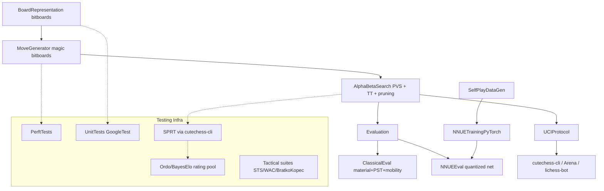

# C++ NNUE Chess Engine — Plan

## Reality check (read this first)

Stockfish is ~3600+ Elo, built over ~15 years by hundreds of contributors, tuned via **Fishtest** — a volunteer distributed cluster that runs on the order of *tens of millions* of test games (multiple CPU-millennia of compute) per year. On a single personal machine, in a few months, literally *surpassing the current Stockfish release* is not realistically achievable — no solo/small project has done this.

Given that constraint, this plan optimizes for the best achievable outcome:
1. Build a genuinely strong, modern, correctly-engineered engine (classical search + NNUE) using the same techniques top engines use.
2. Build real Elo-measuring test infrastructure (SPRT, Ordo/BayesElo rating pools, regression suites) so every change is *provably* an improvement, exactly like Stockfish's own dev process.
3. Structure the project so it can scale later (cloud burst for self-play generation / a small volunteer test pool) if you want to keep pushing after the initial build.
4. Track progress on an absolute scale (vs. lower Stockfish skill levels, vs. other open engines like Berserk/Ethereal) so you always know where you stand relative to Stockfish, even if full parity isn't reached in this timeframe.

Everything below is still built toward maximum strength.

## Architecture overview

## Phase 0 — Project scaffolding

- CMake-based C++20 project: `src/{board,movegen,search,eval,nnue,uci}`, `tests/`, `tools/{datagen,train}`, `scripts/`.
- Board representation: bitboards, magic bitboards for sliding pieces (precomputed or PEXT on supported CPUs).
- GoogleTest (or Catch2) for unit tests, wired into CMake `ctest`.

## Phase 1 — Correct move generation (foundation for everything)

- Implement fully legal move generation (or pseudo-legal + legality filter).
- **Perft test suite**: standard perft positions (startpos, Kiwipete, position 3-6 from the CPW perft test set) with known node counts to depth 5-6. This is the single most important correctness gate — any bug here poisons every Elo test downstream.
- CI-style script (`scripts/run_tests.sh`) runs unit tests + perft on every change.

## Phase 2 — Classical search + eval baseline

- Iterative deepening + alpha-beta with PVS, transposition table (Zobrist hashing), move ordering (MVV-LVA, killer moves, history heuristic), quiescence search.
- Standard pruning/reductions: null-move pruning, late move reductions (LMR), aspiration windows, futility pruning.
- Classical eval: material, piece-square tables, mobility, king safety, pawn structure (passed/isolated/doubled pawns).
- UCI protocol implementation so the engine can be driven by any GUI/test tool.
- Target: get this baseline playing legal, sane chess and passing tactical test suites (Bratko-Kopec, Win At Chess) before investing in NNUE.

## Phase 3 — Testing & rating infrastructure

- Install/script **cutechess-cli** (or `fastchess`) as the match runner — industry-standard for engine-vs-engine testing.
- **SPRT (Sequential Probability Ratio Test)** harness: script that takes two engine builds, an opening book (e.g. 8-mover `.epd`/`.pgn` book), a time control, and runs games until SPRT accepts/rejects an Elo hypothesis (e.g. H0: 0 Elo gain, H1: +5 Elo) — mirrors exactly how Stockfish accepts/rejects patches on Fishtest.
- **Rating pool**: maintain a small round-robin tournament of engine versions + anchor engines (multiple Stockfish releases at various `UCI_LimitStrength`/skill levels, plus other open engines like Ethereal/Berserk if available) and compute relative Elo with **Ordo** or **BayesElo**.
- Regression/tactical suites: STS (Strategic Test Suite), Bratko-Kopec, WAC — run automatically to catch tactical blindness regressions that SPRT alone might miss in a reasonable game count.
- Wrap all of this in a single `scripts/test_build.sh` so every meaningful change goes: perft -> unit tests -> tactical suites -> SPRT vs previous best build -> promote if passed.

## Phase 4 — NNUE

- Small efficiently-updatable network (HalfKP/HalfKA-style input, similar to early Stockfish NNUE nets) — implement quantized (int8/int16) inference with incremental accumulator updates for speed.
- Training pipeline in PyTorch (following the open-source pattern used by `nnue-pytorch`/similar community trainers), exporting to the custom binary format your engine loads.
- **Bootstrap data loop**: use the Phase 2 classical engine to self-play and generate labeled positions (search score + game result), train first net, swap into eval, then iterate (generate -> train -> replace -> re-test via SPRT) — this mirrors how Stockfish itself bootstrapped NNUE from its classical eval.
- Every net swap goes back through the Phase 3 SPRT gate before being accepted.

## Phase 5 — Tuning & iteration loop

- Parameter tuning for search/eval constants via SPSA or Texel tuning (using the same self-play game data).
- Continuous loop: datagen -> train/tune -> SPRT-gated promotion, run as long as compute allows on the single machine; document how to burst to cloud spot instances later if more self-play throughput is wanted.
- Track Elo trajectory over time against the fixed anchor pool so progress is measurable and honest.

## Deliverables

- `README.md` documenting build, UCI usage, and how to run the full test pipeline.
- `scripts/test_build.sh`: one command to run the entire correctness + strength gate on a candidate build.
- Versioned Elo log (`results/elo_history.csv` or similar) tracked over time against the anchor pool.

## Todo checklist

- [ ] Set up CMake C++20 project structure and GoogleTest
- [ ] Implement bitboard representation + magic-bitboard move generation
- [ ] Build perft test suite against known positions/depths
- [ ] Implement alpha-beta/PVS search with TT, pruning, and classical eval
- [ ] Implement UCI protocol support
- [ ] Set up cutechess-cli SPRT harness, Ordo rating pool, tactical suites
- [ ] Implement NNUE inference architecture (quantized, incremental accumulator)
- [ ] Build self-play datagen + PyTorch training pipeline for NNUE
- [ ] Set up SPSA/Texel tuning and continuous SPRT-gated iteration loop
