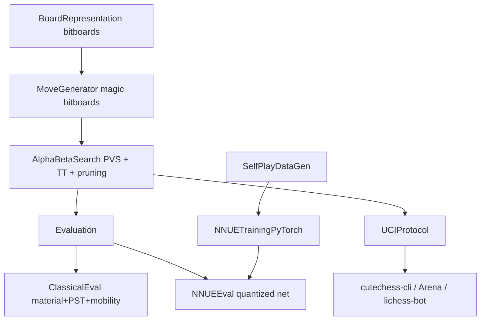

# adityahallucinates

A from-scratch C++ chess engine project, aiming for the highest possible playing strength using classical alpha-beta search plus an NNUE (efficiently-updatable neural network) evaluation, backed by a rigorous, Stockfish-style testing pipeline.

> **Goal calibration:** the stated target is to beat the current strongest Stockfish release. Stockfish is the product of ~15 years of development by hundreds of contributors, tuned via [Fishtest](https://tests.stockfishchess.org/tests), a distributed cluster running tens of millions of test games per year. This project is built on a single personal machine, so full parity/surpassing Stockfish outright is an extreme long shot in the short term — but everything here is engineered toward maximum strength, using the same techniques and the same rigorous SPRT-based testing methodology top engines rely on, so every change is a provable improvement. See [PLAN.md](PLAN.md) for the full reasoning and phased roadmap.

## Status

Early stage — project scaffolding and planning. See [PLAN.md](PLAN.md) for the complete roadmap and [PLAN.md#todo-checklist](PLAN.md#todo-checklist) for progress.

## Architecture



## Planned project layout

```
src/
  board/      # bitboard position representation, Zobrist hashing
  movegen/    # magic-bitboard legal move generation
  search/     # iterative deepening alpha-beta / PVS, TT, pruning
  eval/       # classical hand-crafted evaluation
  nnue/       # quantized NNUE inference (incremental accumulator)
  uci/        # UCI protocol implementation
tests/        # unit tests (GoogleTest) + perft correctness suite
tools/
  datagen/    # self-play data generation for NNUE training
  train/      # PyTorch NNUE training pipeline
scripts/      # test_build.sh, SPRT harness, rating-pool tooling
results/      # Elo history / test logs
```

## Testing philosophy

Every change is expected to pass through, in order:

1. **Perft correctness** — move generator node counts checked against known perft results for standard test positions.
2. **Unit tests** — board, move generation, and eval component tests via `ctest`.
3. **Tactical regression suites** — STS, Bratko-Kopec, Win At Chess (WAC).
4. **SPRT strength test** — [cutechess-cli](https://github.com/cutechess/cutechess) / [fastchess](https://github.com/Disservin/fastchess) runs a Sequential Probability Ratio Test between the candidate build and the current best build (or an anchor engine) before a change is accepted, exactly like Stockfish's own Fishtest workflow.
5. **Rating pool** — relative Elo tracked over time against a fixed anchor pool (multiple Stockfish skill levels, other open-source engines) using [Ordo](https://github.com/michiguel/Ordo) or BayesElo.

See [PLAN.md](PLAN.md) for the full phased plan.

## Building

Build instructions will be added once the CMake scaffolding lands (Phase 0 of the plan).

## License

TBD.
